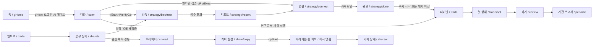

# CURRENT FLOW MAP — CODEX PHASE 1

- 기준: 2026-09-24, `index.html` SHA-256 `38014c3867de7a9d8fb65567dff999c8081e39128476b0c03525d17f459c558d`. 행 표기는 별도 명시 없으면 이 파일 기준이다.
- 정적 코드 추적 결과다. 실제 브라우저 렌더·뒤로가기 클릭은 미확인. 판정 함수 일부는 메모리에서 격리 실행했다([상태 매트릭스](CURRENT_STATE_MATRIX.md)).
- `t=tfS()`, `sx=G.cur`, `b=bcInit()`. 게스트 허용은 기본 라우터/버튼 흐름 기준이며, 함수 직접 호출에 인증 검사가 없을 때는 따로 표시했다.

## 1. 라우트 해석과 화면 수명

| 계층 | 코드 근거 | 실제 동작 |
| --- | --- | --- |
| 최상위 해시 라우터 | `tfRoute` L15735–15761; hashchange L15763 | trade/plan/review/periodic/insight → tfNFRoute; share t/copy/c/s → 각 라우터; strategy → 작업 상태 검사 후 렌더 |
| strategy 라우트 | L15750–15761 | report/connect/done만 명시 분기. 나머지 `#/strategy/*`는 전부 tfWorkView. 실제 검증 CTA는 **`#/strategy/backtest`** L9393. 알려진 `#/strategy/work`도 work를 렌더하지만 정식으로 구분된 별도 라우트 아님 |
| 공개/인증 | `tfNFRoute` L15040–15056 | insight는 공개 namespace; guest trade는 인트로; plan/bot/review/periodic은 로그인 모달+home. strategy는 !user 또는 intake.asset 없음이면 해시 제거·반환 |
| 부팅 복원 | L15774–15775, L16812–16826 | 900ms 타이머와 STORE 복원 뒤 재라우팅. TF_STATE_READY로 일부 missing 판정 지연; hash 없으면 저장 lastSid 연구 세션 복귀 |
| 해시 없는 view | `gContent` L6788–6795 | TF_RENDERING=false이고 부팅 완료면 기존 앱 해시를 replaceState로 제거. 함수형 화면은 주소·히스토리 엔트리로 식별되지 않음 |
| 복귀 | `tfBackToChat` L15764–15771 | G.cur → 보존한 공유/인사이트 이전 세션 → G.sessions[0] → gHome 순. 새 전략 생성 함수가 아님 |
| 터미널/인트로 | L10178, L15019 | 둘 다 URL을 `#/trade`로 replaceState. 같은 URL에서 계정·전략·일시 PEEK 플래그에 따라 화면이 달라짐 |



## 2. 기본 UI 화면별 맵

| 화면 / mode·라우트 | 진입 | 필요한 상태 | 읽는 상태 | 주요 CTA의 실제 동작 | 다음 화면 | 막힘·복귀 제한 | 중복 흐름 |
| --- | --- | --- | --- | --- | --- | --- | --- |
| 홈 `home` | gHome L7092; boot L16843; 브랜드 | 게스트 가능 | user, 템플릿, 언어; 진입 시 G.cur=null | 전송→gNew; 템플릿은 질문 조합 L7261–7266 | 인증→conv | gHome 재진입은 템플릿 초기화 L7094 | classic home과 별도 |
| 대화 `conv` | gNew L7261 / gSelect L7204 / gShowConv L7288 | 새 대화는 로그인+tfAiGate | sx.strategy/ai/convo/thread/step/pendingChips/btHist; TAI.busy | 질문 전송→gSend; 인라인 검증→gBtRun; 위임 액션→tfStart | 인라인 보고서·artifact·tfwork | 요청 중 토스트; free-out/watch는 입력 보존 차단 L16689–16692 | 연구·위임 2개 전략 작성 파이프라인 |
| 인라인 검증/보고서 `conv` 내부 | gBtRun L7601 / gRptShow L7649 | G.cur 필요; 실행은 score≥80 | sx.btHist, S.strategy, 검증 p | 실행→gRptExec가 t.intake/cur/score에 복사 L7721–7738 | strategy/connect | 검증 이력 없거나 미달이면 토스트; 자체 route 없음 | tfwork/report와 별도 결과 모델 |
| 연구 진행 `activity` | gStartRun→gStartRunGo→gShowActivity L7778/L7824/L7760 | 로그인; 다른 연구 run 없어야 함 | sx.status/team/actRows/artifacts/versions | 문서 열기→gOpen; 완료 시 보고서 | artifact | 복원된 run은 stopped L8423; hash 없이 lastSid 복원에 의존 | tfwork 검증 진행과 별개 |
| 연구 계획 `artifact:plan` | gPlanOpen L7583 / gOpen('plan') L7936 | G.cur | sx.strategy, 연구 계획 | 연구 시작→gStartRun | activity | 로그인 모달 후 pendingRun 복귀 L7817 | 위임 intake/조건 확인과 중복 |
| 가설 `artifact:hypo` | gOpen('hypo') L7937 | G.cur | S.strategy | 문서 코멘트→gRowComment, 컴포저→gSend | 같은 문서/대화 | hash 없음 | 연구 문서 전용 |
| 전략 문서 `artifact:strat1/strat2` | gOpen L7938 | G.cur; 버전 유무는 렌더 의존 | strategy/versions | 코멘트/후속 연구 | 같은 문서/대화 | 문서별 URL 없음 | 전략 객체 자체는 sx.strategy |
| 백테스트 `artifact:btN` | gOpen L7939 | bt1/bt2는 버전 가드 L7933 | S.versions, activeVer | 버전 보기·질문 | artifact | 동적 btN 라우팅은 문자열 id; hash 아님 | 인라인·tfReport와 중복 |
| 비판·스트레스·홀드아웃 `artifact:critic/stress/holdout` | gOpen L7940–7942 | G.cur, 결과 버전 | versions, 검증 파생 결과 | 문서 코멘트/질문 | artifact | 결과 없으면 토스트 L7933 | 연구 문서 전용 |
| 최종 연구 보고서 `artifact:report` | gOpen L7943 | G.cur, versions | 연구 결과/전략 | 연결 문서 열기 | artifact:connect | 단일 위임 t.cur를 쓰는 report와 다름 | 3종 보고서 병존 |
| 연구 연결 `artifact:connect` | gOpen L7944; gDocConnect L8104 | G.cur; 함수 내부 상업 게이트 없음 | 표시 문구 중심 | “Binance로 간편 연결”→gOauth, 1.5초 후 gOpen('run'); “파트너 거래소로 시작”→MOCK 토스트만 L8106–8116 | artifact:run | **api/uid/conn을 set하지 않음** | strategy/connect와 다른 연결 |
| 연구 실행 확인 `artifact:run` | gOauth→gOpen L8116 | 연구 결과; G.cur | S.strategy, 마지막 versions | 가상 시작→gGoLive('paper')→gToTerminal; real→잠금 토스트 L8128/L8154 | trade | paper 시작에는 conn/score 게이트 없음; 이후 재개는 conn 필요 | 위임 done과 다른 실행 |
| 연구 Live `artifact:live` | live 세션 gSelect L7212 / gOpen L7946 | sx.live 맥락 | sx.liveMode/livePaused, strategy | 터미널 열기; 일시정지→sx.livePaused; 종료→sx.live=false L8163–8190 | trade / artifact:report | 연구 일시정지·종료는 t.strat 봇을 변경하지 않음 | 터미널 제어와 중복·불일치 |
| 연구 기록 `history` | gHistory L8248 | 게스트 함수 가드 없음; 계정 세션 목록 기반 | G.sessions, GH.q/limit | 검색/더 보기; 항목→gSelect | conv/activity/artifact | hash 없음; 로그인 없음이면 보통 빈 목록 | classic history는 거래 기록이라 의미 다름 |
| 예약된 검증 `schedule` | gSchedule L8279 | 함수 가드 없음 | sx.live 목록 | 행→gSelect; 매주 월09:00 표시 L8286–8291 | 해당 세션 | 생성/편집 예약 엔진은 이 함수에 없음. 현 UI 버튼 도달성 미확인 | periodics의 실제 기간 집계와 다름 |
| 트레이딩 인트로 `tfintro`, `#/trade` | tfNFRoute L15049–15052; 사용 방법→tfIntroView(1) L10222 | 게스트 가능; 로그인은 전략0 기준 | user, strat/termClones 길이, PEEK; rank seed | 시작→인증/선택섹션; 1위 복제→share/s; 나만의 전략→tfBackToChat; 미리보기→tfIntroPeek L15004–15013 | 공유 상세/기존 대화/터미널 | 긴급정지는 “운용 중 전략 없음” 토스트만 L15004; force 도움말에서도 같은 버튼 | 같은 trade URL의 터미널과 공존 |
| 터미널 `tfdash`, `#/trade` | route 또는 tfDashView 직접 L10125 | route는 로그인 후 분기; 게스트도 인트로 미리보기로 직접 가능 | tfTmAll, TF_TM, api, notifs, periodics | 전략 선택/필터; 시작·재개·중지→tfTmSetStatus; 자연어 변경→tfTmSay→tfTmApply; 새 전략→tfBackToChat | 같은 터미널/채팅/연결 | api 없으면 6개 하단 탭 잠금. “새 전략”은 기존 대화로 복귀할 수 있음 L10195/L15768 | user/demo/clone를 같은 VM에 표시; cp 제외 |
| 봇 상세 `nfbot`, `#/trade/bot/<id>` | route L15053; 대기 배너 L10143 | 로그인+해당 t.strat.at | bot,p; fillLog/reviews/rebates; **현재 t.api** | pause/resume/start/env→tfBotCtl; 수정→tfBotEdit | 동일 상세/연결/복기 | id는 user bot의 at만; demo:d1/clone id 직접 상세 불가 L13340 | 터미널 제어·수정과 중복 |
| PLAN `nfplan`, `#/plan` | 설정 PLAN L4989; tfPlanGo L12987 | 라우트 로그인 | tfEnt, creditBal/freeUsed/uidLinked/payDone/tradeActiveUntil, bill.mode | UID 연동→tfNFLinkUid; 구독→tfUpSheet('plan')→tfNFUpgrade | 동일 PLAN / connect / 이전 대화 | 미검증 사용자는 구독 CTA가 checkout으로 안 감 L13317–13321 | 구형 구독과 새 카드 원장이 분리 |
| 정산 `nfplan`, `#/plan/rebates` | plan tab / 알림 L13042 | 로그인 | rebates | 개별 정산→tfNFRebGo L13136; 기간·금액 표시 | 복기/봇/터미널(존재하는 기록 기준) | 터미널 하단의 정산 탭은 제거됨 L10146 | cp 수익분배/원장과 별개 |
| 알림 설정 `nfplan`, `#/plan/alerts` | 알림 pane 수신 설정 L10914 | 로그인 | notifPrefs | 체크/토글→tfNFPrefI/tfNFPref L13134/L13247 | 동일 화면 | 채널별 실제 전송은 이 설정 함수에 없음 | 벨 알림 pane와 별개 |
| 알림 pane `tfdash` 내부 | 벨→tfNFGoAlerts L10945 | 벨은 로그인 때 노출 L12965 | notifs, NF_TAB | 모두 읽음→tfNotifReadAll; 행→tfNotifGo | trade/bot/review/periodic/plan | 별도 hash 없음; TF_NFH_OPEN은 1회 임시값 L10180 | 전용 drop-down 함수는 잔존하지만 벨은 pane 사용 |
| 거래복기 `nfreview`, `#/review/<id>` | 알림/봇/정산 L13067 | 로그인+review 존재 | review, bot, periodics | 봇 상세/기간보고서/트레이딩 이동 L13596/L13614 | nfbot/nfperiodic/trade | 봇 삭제 뒤에도 CTA는 남고 missing bot은 trade로 폴백 | 터미널 검증 리플레이 설명과 별개 |
| 기간보고서 `nfperiodic`, `#/periodic/<id>` | 알림/복기 L13078–13089/L13596 | 로그인+periodic 존재 | periodic + 해당 기간 reviews | 개별 복기/트레이딩 | nfreview/trade | reviews 최대60개라 저장 집계와 드릴다운이 나중에 달라질 수 있음 L13065/L13622 | schedule 표시와 다른 생성 경로 |
| 공유 허브 `tfss3`, 해시 없음 | tfShareHub(find/follow/mine) L11141 | 게스트 열람 가능 | ss, follows, sharedSnap, strat, cp.copies, watch | find 필터·정렬→재렌더; follow 관리; mine 공개 | ss3d/tfcpp/tfcpx/대화 | 진입 시 해시 제거 L11146. 새로고침으로 현재 탭 화면을 직접 복원하지 않음 | 구형 설정복제와 cp 카피를 follow 탭에 합성 |
| 공유 전략 상세 `tfss3d`, `#/share/s/<nick>[/1y/2y]` | tfSS3Go/Route L11883–11904 | 공개 seed; me는 로컬 snapshot 필요 | seed/snapshot.p·성과, 기간, watch | 따라하기→tfSS3Copy; AI 분석→tfSS3Ask→gNew; 관심→watch; 공유링크 | 모달→strategy/backtest / conv | 닉/기간 불일치는 허브; me는 서버 게시글 id가 아니라 로컬 예약어 L11023–11031 | trader profile은 같은 seed를 다른 모델로 표현 |
| 트레이더 프로필 `tfcpp`, `#/share/t/<nick>[/ov/pos/cal/bal/cop]` | cpProfileGo/Route L11252–11262; 관심/팔로우 이름 | 게스트 가능; seed me는 거절 | tfSSFind, cpMeta, TF_CPP.pd, watch | 카피 시작→cpSetupGo; 탭; 캘린더 빈 상태→share/s L11356–11371 | tfcps/ss3d | pos/cal/bal/cop은 대부분 설명·준비 빈 상태, 실시간 개인 기록이 아님 | ss3 상세의 동일 닉네임 전략과 중복 |
| 카피 설정 `tfcps`, `#/share/copy/<nick>` | cpSetupGo 또는 route L11735–11750 | 버튼은 로그인+AI gate; 딥링크 view는 열림, 최종 시작 재검사 | cp.spot, TF_CPS.mode/pairs, seed | 비율+금액→cpStart; 충전→spot+1000; 페어 변경; margin은 준비중 | 허브 follow / profile | fixed margin 시작 불가; API/UID/plan 검사는 없음 L11855–11873 | ss3 설정복제와 달리 재검증 퍼널을 거치지 않음 |
| 카피 상세 `tfcpx`, `#/share/c/<cpid>[/pos/hist/share/bal/tx]` | cpDetailGo/Route L11506–11518 | 로컬 copy 존재; view 로그인 가드 없음 | cpFind, cpCalc, copy.status | 잔고 조정→cpAdj*; 정리→cpFlat; 종료→cpClose; 페어 설정 | 동일 상세/허브 follow | 없는 id→follow. 카피 종료는 되돌리기 대신 새 카피 필요; 수정 모드는 종료 후 재시작 안내 L11555 | 일반 bot 상세·터미널과 완전히 다른 원장 |
| 위임 검증 `tfwork`, `#/strategy/backtest` 또는 기타 strategy 경로 | tfVerifyGo L9384; tfSS3CopyGo L12334 | user+intake.asset; 결과 없어도 가능 | intake,pendingP,tries,cur,score,workDone,token | 검증→tfWorkRun; 실패 재시도/권장 변경/직접 수정/다른 전략 | tfreport/conv/허브 | 오류 패널 재시도; pass 미달은 개선. workDone+cur 있으면 기존 결과 L9455 | 인라인·연구 검증과 별개 workspace |
| 위임 리포트 `tfreport`, `#/strategy/report` | 검증 통과 CTA / tfResume | 로그인+intake+cur+score≥80 | cur,score,intake,conn,payDone,upFor | 실행→connect; 쉬운/전문가 보기; 시트 UID/구독/later | tfconnect | 미통과→backtest; 업그레이드 유도는 결과 지문당1회 L9594–9597 | artifact report/인라인 보고서와 다름 |
| 실행·결제·연결 `tfconnect`, `#/strategy/connect` | report/gRptExec/거래소/upgrade | 로그인+intake+검증 통과 | plan,payDone,pay,ob,cycle,TF_NF_RESUME | partner/paid 선택→가입·UID 또는 checkout→API | 같은 view의 단계 / done / 기존 봇 | ob.st가 단계 결정 우선. 계정 결제·연동이 개별 현재 검증 작업에 종속 L9678–9705 | 연구 간편연결 및 Fast API와 중복 |
| 준비 완료 `tfdone`, `#/strategy/done` | API 확인 후 connect 4단계 | 로그인+intake+api+검증 통과 | cur,score,api,plan,intake | 전략 시작→tfStartStrategy; 가상→TF_NF_ENV=paper 후 시작; later→ready 저장 | tfdash / 이전 대화 | 완료 화면 자체는 conn을 켜지 않음. 시작/later가 켬 L9928/L9953/L9962 | 3가지 실행 경로 |
| 거래소 목록 `tfbrokers`, 해시 없음 | tfBrokersView L15379; 설정/연결 빈 상태 | 게스트 가능 | bkSort/filter, TF_BROKERS, api, user | 필터·정렬; 항목→tfBrokerView; 연결→tfBkConnect | tfbroker/인증/시트 | 연결 지원 필터는 사용자 연결 여부가 아니라 b.conn 기능 지원 L15388 | 온보딩 거래소 선택과 별개 카탈로그 |
| 거래소 상세 `tfbroker`, 해시 없음 | tfBrokerView(id,tab) L15469 | 게스트 가능 | api.ex,uidLinked,payDone,user,bkRev/tab/정렬 | 연결→tfBkConnect; 계좌 개설→외부 링크; 리뷰 작성→로그인/모달 | trade / 시트 / connect / 외부 | 연동 권한 있어도 현재 검증 없으면 토스트에서 멈춤 L15459; hash 복원 없음 | 마법사 및 Fast API 연결 개념과 중복 |
| 인사이트 홈·태그 `nfins`, `#/insight`, `#/insight/t/<tag>` | 설정/인트로 footer/route L14589–14601 | 게스트 가능, STATE_READY | 정적 TF_INS2, tag, user, 개인화 상태 | 기사/태그/맞춤 콘텐츠 | 기사/개인화 | 잘못된 주소→홈, 빈 태그→토스트 | nfins mode를 기사·메일과 공유 |
| 인사이트 기사 `nfins`, `#/insight/<slug>` | 홈 카드 / 링크 | 게스트는 본문 일부 | 기사·user·TETH_INS_FB:slug | 계속 읽기→auth+복귀; 자산 질문→tfIns2AssetDlg; AI 질문→gNew; 평가→localStorage | 같은 기사/conv | 인증 일반 경로도 기사 재렌더 L7813–7815; 자산 질문 자체 자동 재개는 별도 보존 안 함 | 같은 질문 생성기를 사용 |
| 맞춤 인사이트 `nfins`, `#/insight/p/<a\|b\|c-YYYYMMDD>` | 개인화 카드·메일 | 로그인+개인화 근거+48h 유효 token | tfIns2PInfo/PData, 현재 날짜 | 최신 생성 / TETH에게 질문 | nfins/conv | 상태군 바뀌거나 만료→최신 버전 안내 L14523–14538; cp/clones는 개인화 입력 아님 | 일반 기사와 별도 상태별 콘텐츠 |
| 이메일 미리보기 `nfins`, `#/insight/email` | 인사이트 경로 L14592 | 로그인+pd 존재 | 현재 개인화 데이터·token | TETH에서 계속 읽기 | 개인화 상세 | 메일 발송 기능이 아니라 미리보기 L14563–14586 | 개인화 데이터의 요약 표현 |

## 3. 오버레이와 구형 화면

| 화면 | 진입·필요 상태·읽는 값 | CTA → 결과 | 복귀·중복·근거 |
| --- | --- | --- | --- |
| 인증 modal | authOpen(login/signup), AUTH·입력 draft | 소셜 로그인/이메일→코드/비밀번호/가입 확인→signupDone | G.mode 변경 없음. 기본 가입 완료는 broker/insight/pendingRun/pendingNew/draft 분기만 L7783–7822; 모달 L16861–17007 |
| 설정 menu | gSetMenu(event), user | PLAN→#/plan; 지원 거래소·인사이트·언어/통화·프로필 로그아웃 | 로그인별 항목 노출 L17453–17454/L17606–17623; 주소 없는 오버레이 |
| QA panel | tfDevPanelTgl, 인증 가드 없음 | login/uid/pay/api/free/strat/card/bwarn/bwatch 토글→tfDevTgl; reset | 독립 boolean 9개, 시나리오 프리셋 아님 L15801–15929. 일부 화면만 재렌더 |
| 업그레이드 sheet | follow/backtest/quota/plan/bk 맥락, TF_UP_CTX | UID→tfNFLinkUid; 구독→tfNFUpgrade; later→follow만 자동 재개 | quota에는 later 버튼 없음; X는 존재 L13255–13321 |
| API/UID 도움말 drawer | tfUidGuide/tfApiGuide, ob.ex | 닫기→배경 입력 유지 | 화면 이동은 아님 L9873–9898/L15779–15798 |
| 공유 복제 3단계 modal | tfSS3Copy→CopyPrev→CopyGo; user, 원본 p | 조건→예상결과→확정, 글로벌 t 작업 교체·follows 저장 | 자격 유도는 소프트 게이트; watch와 독립 L12240–12334 |
| 공유 공개 modal | tfSS3ObOpen, t.strat 통과 전략 | 선택→설명→공개 snapshot | 하나의 sharedSnap만 보유 L12484–12560 |
| 전략 수정 modal | tfBotEdit, bot.p | 재검증→후보→적용·중지 | 터미널 자연어 변경은 다른 후보·버전 관리 L13529–13581/L10652–10686 |
| 카피 자금·종료 modal | cpAdjDlg/cpCloseDlg, active copy | 입출금 ledger / 종료 정산 | cp 원장만 변경; t.strat/bill에 합류 안 함 L11468–11503 |
| 피드백 panel | fbOpen L17530 | fbSubmit→localStorage 피드백 L17564 | 상업 상태와 무관; G.mode 변경 없음 |
| 고객지원 popover | tethHelpOpen / FAB | zendeskKey 있으면 위젯, 없으면 준비 안내 | 로그인·연결·과금 게이트 없음; `help-widget.js` L72–89 |

`?ui=classic`은 localStorage UI 플래그를 false로 설정할 수 있다(L6542–6551). 다음은 코드에 남아 있는 **S.view 기반 별도 화면**이다. 기본 gBoot에서는 shell이 숨겨진다(L16830). classic에서 전체 UI 상호작용의 정상 작동 여부는 미확인이다.

| S.view 화면 | 진입 / 상태 | CTA 실제 동작·다음 화면 | 중복·제한 / 근거 |
| --- | --- | --- | --- |
| home | nav/show('home') | startBuilder→builder | G.home와 별개 L5067–5085/L5171 |
| builder | startBuilder, S.strategy | 질문 응답→requestBacktest; 로그인 없으면 모달 | pendingBacktest 복귀 L5411–5422 |
| analyze | startAnalysis 또는 V2 연구 | 완료→backtest | RESEARCH_V2 플래그 L6089–6099; 별도 연구 상태 |
| backtest | renderBacktest / renderReportV2 | 수정·버전선택·연결→connect | S.versions 기반; 이후 함수 재정의 존재 L5788/L5892/L6342 |
| connect | show('connect'), chooseConnect | own/partner→oauthConnect 또는 manualConnect→connectedDone | API 원장 기록 없이 run 이동 L5597–5633 |
| run | connectedDone | startLive→live | S.liveOn/paused 계열; t.strat와 별도 L5668 |
| live | nav('live'), renderLive | pause→S.paused; stop→strategies | L5689–5729 |
| strategies | nav('strategies')→renderStrategies | 기존 전략/새 전략 진입 | L5083/L5757; 기본 터미널과 별개 |
| history | nav('history')→renderHistory | 거래 이력 표시 | L5084/L5773; G.history의 연구 목록과 의미 다름 |

## 4. 전략 엔티티와 합류 지점

| 경로 | 생성 데이터 구조 | 합류·식별자 | 합류하지 않는 데이터 / 근거 |
| --- | --- | --- | --- |
| 연구 대화/문서 | sx={id,title,status,strategy,versions,artifacts,team,actRows,convo,thread,tabs,live,rawIntent,step,pendingChips}; 인라인 결과는 btHist | 인라인 실행 `gRptExec`가 **t.intake/cur/score**로 변환→connect L7721–7738 | 연구 진행·AI 히스토리·btHist는 세션 소속 L7273–7275/L8370–8376 |
| 연구 paper 실행 | `gToTerminal`: {key:'rs…',at,name,sym,ex,status:'live',ver:'v1.0',cap:7000000,env:'paper',asset,score,ret,mdd,n,winRate,p,src:'research',sessionId} | t.strat에 unshift; sessionId로 중복 방지; sx.strategyAt 기록 L8131–8151 | 별도 연구 live/livePaused가 계속 남아 두 실행 상태 원천이 됨 |
| 위임 퍼널 | 임시 t.intake→t.cur={p,ret,mdd,winRate,n,sharpe,pf,cagr,tradeVol,trades,startI,endI}; t.score/tries/stage | `tfStartStrategy`→t.strat[{name,score,ret,mdd,n,winRate,p,src,fid,status,at,asset,ex,tv,cap}] L9475–9477/L9967–9969 | singleton 작업공간. 세션별 t.cur가 아님 |
| “나중에 시작” | t.strat에 ready/env=live와 지표/p/src/fid/at 저장 | 같은 user VM으로 표시 L13693–13699 | **asset/ex/tv/cap 스냅샷 없음**; 즉시 시작 스키마와 다름 |
| 터미널 내 복제 | {id,name,ex,asset,sym,mkt,tv,cap,ver,status:'ready',p,verHist:[]} | **t.termClones**에 push, VM `clone:<id>` L10728–10734 | t.strat, 공유 가능한 내 전략, nfbot 상세, 개인화 목록에 자동 병합하지 않음 |
| ss3 설정 따라하기 | follows[{id,nick,asset,p,budget,at,archived?}], t.cloneFrom/followId, t.intake/pendingP | 재검증→같은 위임 퍼널→t.strat.src/fid 연결 L12318–12334/L9967 | follows는 작업 추적 기록이고 계좌 미러링 아님; 보관은 봇을 중지하지 않음 L12420–12428 |
| ss3 공개 | sharedSnap={name,asset,score,ret,mdd,n,winRate,p,srcAt,desc,at}; shared=true | t.strat의 1개를 snapshot으로 복사; `/share/s/me` L12555–12560/L11023 | 봇 변경·삭제에 따라 자동으로 최신화하지 않음; 공개 주소는 사용자 서버 식별자가 아님 |
| cp 비율 카피 | cp.copies[{id:'cp…',nick,mode:'ratio',amount,pairs,simStartI,adv,at,status:'active',ledger}]; spot 차감 | follow 허브 안의 cpDashSec + `/share/c/<id>` L11868–11879/L12380 | **t.strat·termClones·follows에는 추가 안 함**. p snapshot 대신 현재 nick seed를 cpCalc에서 조회 L11385 |

### 데모 d1–d6와 user:*의 혼합

- `tfTmAll()`은 사용자 전략→삭제되지 않은 데모 6개→터미널 복제 순으로 합성한다(L10013–10043). 로그인 여부·실거래 연결 여부로 데모를 목록에서 제외하지 않는다.
- 데모 키 `demo:d1`~`demo:d6`, 사용자 키 `user:<at>`, 복제 키 `clone:<id>`이다. demo 원본은 TF_TERM_DEMO, 변경은 termDemo overlay, 숨김은 termDel로 분리한다(L9986–10005/L10028–10041).
- 데모 기본 상태는 d1/d3/d4=live, d2=off, d5=ready, d6=err다(L9987–9999). 기본 선택은 이전 선택→최근 live→첫 항목이다(L10135–10137).
- UI에서 전체 범위를 선택하면 **세 출처가 모두 집계 대상**이다(L10768–10771). 연결 잠금은 현재 `t.api`가 존재하는지만 검사하므로 한 거래소 API가 생기면 다른 거래소 데모 행도 표시 대상이 된다(L10780).
- user VM에는 bot.sym 대신 `asset+'/KRW'`가 들어가며, 없던 asset/ex/tv/cap은 전역 intake/api로 보충한다(L10019–10026). 연구에서 만든 BTC/USDT 필드도 이 변환에서는 보존되지 않는다.
- user 상태 변경은 tfBotCtl→conn gate를 거치지만 demo/clone은 score gate와 자기 저장소만 변경한다(L10105–10117). **같은 터미널 버튼이라도 상태 전이 조건이 다르다.**

## 5. 인트로 vs 터미널의 정확한 분기

```js
// index.html L14607–14611
tfIntroUk = S.user ? String(S.user.email || S.user.name || 'u') : '';
needIntro = !!S.user
  && !(t.strat || []).length
  && !(t.termClones || []).length
  && window.TF_INTRO_PEEK !== tfIntroUk;
```

| 진입 조건 | 결과 | 근거 |
| --- | --- | --- |
| guest + `#/trade` | tfIntroView | L15049. tfIntroNeed=false여도 이 분기가 먼저 실행 |
| 로그인 + needIntro=true + TF_NFH_OPEN 없음 | tfIntroView | L15052 |
| 로그인 + 전략/clone 존재 또는 PEEK 일치 또는 알림 열기 | tfDashView | L15052 |
| 직접 tfDashView 호출 | 조건 검사 없이 터미널 | L10125–10139 |
| “터미널 미리 둘러보기” | PEEK=현재 계정 키 후 직접 터미널 | L14612/L15012 |
| API·UID·구독만 있고 전략0 | 원칙상 인트로 | 이 세 변수는 tfIntroNeed 입력에 없음 |
| cp active만 존재 | 인트로 | cp는 길이 검사에 없음; 격리 실행 true 확인 |
| 데모6개만 존재 | 인트로 | demo는 전략 수에 포함 안 함 |
| 마지막 user/clone 삭제 | tfIntroNeed 결과로 결정 | L10764. PEEK가 이미 설정돼 있으면 인트로로 안 갈 수 있음 |

## 6. 거래소 연결 용어 ↔ 상태 변경

| 사용자 라벨/개념 | 함수·위치 | 실제 set | 실제로 성립하지 않는 연결 / 다음 화면 |
| --- | --- | --- | --- |
| UID 무료 연동 (Fast API) | PLAN L13167; sheet L13276; tfNFLinkUid L13324–13337 | uidLinked=true; creditBal+1000(1회); CARD_UID일 때 새원장 promo100; bcAfterChange | UID 입력 없이 실행됨. **uid/api/conn/ob.st를 set하지 않음**; PLAN/현재 화면 유지 |
| 파트너 거래소로 시작 / 무료로 시작 | tfPlanPick('partner') L9721–9732 | plan=partner, ob.st=plan_free, stage=connect | 외부 가입 링크→가입 완료→UID 입력→API 입력. 클릭만으로 연결 안 됨 |
| 파트너 UID 확인 | tfCnUid L9853–9869 | ob.uid, uid, ob.st=uid_verified, uidLinked=true, 구형 지급·프로모 | API는 아직 없음. 다음 단계 tfApiHtml |
| 기존 거래소 연결 | tfPlanPick('paid') L9724–9733; pay 성공 L9805 | plan=paid, pay.step, payDone=true, stage=connect | 결제 이후 거래소 선택→ob.st=api_pending; UID 필요 없이 API 가능 |
| API Key / Secret Key / OKX Passphrase | tfCnApi L9900–9919 | ob.st=api_verified; api={ex,last4} | uidLinked 보장 안 함; conn은 done의 시작/later 또는 resume branch에서만 true |
| FAST API KEY 연결 | TFCOPY.obApiBtn (`teth-copy.js` L163) | 카피 설정 문자열 | 현행 `tfApiHtml` 실제 버튼은 “권한 확인하고 연결하기” L9891. 문자열 존재와 현재 사용 화면 구분 |
| 거래소 카탈로그 “연결됨” | tfBk2Conn L15376 / tfBkConnSt L15440 | 표시만; user+api.ex 일치 | conn은 안 봄. 실제 시작 gate와 다름 |
| 거래소 상세에서 연결 | tfBkConnect→tfBkGoLink L15448–15465 | 자격에 따라 plan 정규화, ob.ex, uid_pending/api_pending | 현재 검증 없는 계정은 토스트에서 정지; API를 직접 set하는 별도 연결 기능 아님 |
| 계좌 개설/파트너 링크 | tfBkOpenAcct L15436 / tfCnRefOpen L9845 | 카탈로그는 상태 변경 없음; 마법사는 referral_opened | 외부 새 탭만 열며 가입 완료 검증은 이후 UID 단계 |
| Binance로 간편 연결 (연구 문서) | gOauth L8114–8116 | 버튼 상태만 | api/conn/uidLinked 없이 run 문서 이동 |
| 간편 연결 / API 키 직접 입력 (classic) | oauthConnect/manualConnect L5613–5629 | classic UI 진행만 | connectedDone→show('run'); t.api를 set하지 않음 |
| 거래소 연결 (Binance) (QA) | tfDevTgl('api') L15847–15849 | api={ex,uid}; 필요하면 로그인 | conn=true도 uidLinked=true도 아님. 해제 시는 conn/ob를 정리 |

## 7. 결제·크레딧·관망 용어 ↔ 상태 변경

| 개념/화면 라벨 | 상태·산식 | 생성·소비 경로 | 다른 개념과의 차이 |
| --- | --- | --- | --- |
| “PRO 멤버십”, “구독 중”, “무제한” | t.payDone | checkout L9805; tfEnt L12874; PLAN L13157/L13178 | bill.cardOn=false여도 표시 가능; AI 사용 기록 안 늘어남 L12887 |
| “파트너 플랜 ₩0” / “기존 거래소 연결” | t.plan | 선택 L9730; 완료 표시 L9942 | 이번 온보딩 방식. 구독 활성 사실과 같은 값이 아님 |
| 카드 등록 (월 충전) | bill.cardOn + cycleAt + card ledger | bcCardOn/Charged L12742–12757; 실제 UI 진입은 QA L15861–15865 | checkout과 연결되지 않음. 카드 등록 단독은 PRO entitlement 부여 안 함 |
| “PRO 크레딧”, “1,000C 지급” | creditBal, creditGrants.uid | UID L9864/L13330; credit 자격 차감 L12931 | 새원장 잔액과 다른 단위·지급 경로. sheet에는 1000C 표시 L13277 |
| “무료 체험”, “무료 분석 소진” | freeUsed < freeQuota(10) | tfAiSpend free branch L12887–12894 | welcome100을 소비하지 않고 별도 횟수만 증가 |
| welcome / 새 과금 크레딧 | bcBalance = ledger 합 | 로그인 bcBoot→welcome100; credit 자격 AI→debit10; volume/card/promo 유입 | PLAN의 기본 자격 분기는 이 잔액을 안 봄 L13151 |
| “파트너 거래 활성, PRO 무제한” | uidLinked + 미래 tradeActiveUntil | live 신규 fill→30일 L13685–13688 | 거래 高低가 아니며 paid 다음 우선순위 |
| “관망 중” (과금) | bill.mode=watch | 저잔액 유예/결제 실패; tfAiGate 차단 | PLAN hero 일부 문구만 덮음 L13173–13174; 기존 멤버십/CTA는 남을 수 있음 |
| “관망” (Agent 판단) | 엔진 로그 event.k=watch | 일봉 조건 미충족 로그 L10298/L10375–10385 | 과금 모드와 무관. 정상 과금 상태에서도 발생 |
| 거래량 충전 | volume 원장 적립금, cap2000 | tfRebateCommit→bcVolumeCharge L13036–13038 | 명목거래량을 저장한 별도 원장 아님; cp 거래는 이 경로에 합류 안 함 |
| 월 청구·상쇄 | $49×(1-min(1,volumeCredit/3000)), 쿠폰 | bcBillQuote L12763–12773 | 퍼널 월599,000원/연5,000,000원(`teth-copy.js` L22) 및 소개 pricing(`site-config.js` L19–47)과 별개 |

## 8. 확인된 되돌림·중복의 핵심

- **완료 뒤 실행을 미루는 경로와 바로 시작하는 경로가 다른 봇 스키마를 만든다**(L9967–9969 vs L13698). ready→start는 fill·복기·거래활성 커밋 훅을 호출하지 않는다(L13462–13467).
- **구독/연결이 현재 전략 검증을 요구**한다. PLAN 구독은 대화로, 거래소 상세 연결은 토스트로 끝날 수 있다(L13319–13321/L15459). 계정 단위 설정과 작업 단위 상태가 결합돼 있다.
- **단일 t 작업공간**: 새 위임/공유 복제는 기존 t.cur/intake/stage를 교체한다(L9299/L12319–12323). follows·여러 세션은 존재해도 별도 검증 workspace를 보유하지 않는다.
- **2종 따라하기**: ss3는 규칙 복제 후 재검증, cp는 금액 분리 후 카피 계좌 원장 생성이다. 둘 다 follow 허브에 나타나나 종료/실행 관리·API 요구가 다르다(L12255/L11868–11879/L12380).
- **주소 없는 화면**은 G.mode와 로컬 탭 상태만으로 열린다. 허브·거래소·연구문서의 현재 위치를 URL로 재현할 수 없으며, 복원은 lastSid 또는 기존 route를 우선한다(L11146/L6792/L16820–16825).

상태 모순의 재현 시나리오, 우선순위 및 통합 제안은 [CODEX_PHASE1_FINDINGS.md](CODEX_PHASE1_FINDINGS.md)에 정리했다.
