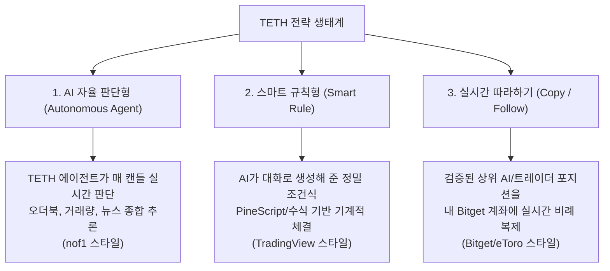

# AGY 독립 제안 — TETH 제품 UX 공격적 비판 및 프로덕션 재설계 안

- **작성자**: AGY (Senior UX Director, Conversion Critic, Anti-Demo Reviewer)
- **일자**: 2026-09-24
- **목적**: 데모 쇼와 가짜 지표로 얼룩진 TETH 프로토타입 UX를 전면 해체하고, 실제 암호화폐 투자자가 3초 만에 신뢰하고 거래소를 연결해 돈을 맡기는 프로덕션 제품으로의 전환 독립 제안
- **대상 화면**: 크롤 실측 22개 주요 화면(1440x900 데스크톱 및 390x844 모바일 스크린샷 100% 실측 분석)

---

## 1. 가장 큰 제품 문제 5개

| # | 핵심 문제 | 증거 스크린샷 | 왜 치명적인가 (전환 및 생존 관점) |
|---|---|---|---|
| **1** | **가짜 AI 사기극: PineScript 고정 규칙을 '자율 AI'로 둔갑** | `d1440__trade_intro_guest__s1.png`<br>`d1440__trade_intro_guest__s3.png`<br>`d1440__terminal_active.png` | "AI가 매 시점 시장을 직접 판단한다"고 거창하게 광고해놓고, 실제 화면의 전략은 `RSI 44 이하 반등`, `+8% 익절 / -5% 손절` 같은 원시적 단일 보조지표 고정 규칙뿐이다. nof1 스타일의 실시간 시장 맥락 추론(오더북, 거래량, 온체인, 무효화 조건)은 어디에도 없고, PineScript IF-ELSE 문을 "AI가 판단 중"이라고 속이고 있다. 퀀트나 트레이더가 보는 순간 사기 서비스로 낙인찍힌다. |
| **2** | **두 개의 서로 다른 복제 시스템 충돌 및 가짜 데이터 모순** | `d1440__share_find_guest.png`<br>`d1440__share_detail_guest.png`<br>`d1440__cp_profile.png`<br>`d1440__cp_setup.png` | 전략 따라하기에서 '세븐틴층' 전략은 `검증 수익 +14.7%`, `승률 62%`, `팔로워 1,284명`으로 표기된다. 그런데 [카피하기]를 누르면 Bitget 카피트레이딩 화면으로 튀면서 동일 인물이 `기간 수익률 -2.72%`, `승률 0.0%`, `카피어 누적수익 -369.82 USDT`, `카피하는 사람 4/500`이라는 정반대의 참담한 마이너스 숫자로 돌변한다. 파라미터 복사(Clone)와 실시간 포지션 미러링(Copy)이라는 완전히 다른 두 모델을 아무 검증 없이 긁어다 붙여놓은 개발자 키메라다. |
| **3** | **사업 목표 역전: Bitget 우선인데 Binance 1위 배치 및 외부 이탈 1차 CTA** | `d1440__brokers.png`<br>`d1440__broker_bitget.png`<br>`d1440__qa_panel.png` | 비즈니스 생존 모델이 Bitget 유동성 커미션 수익인데, 지원 거래소 1순위는 Binance이고 QA 패널의 하드코딩된 기본값도 Binance다. 더욱 치명적인 것은 거래소 카드의 1차 CTA가 내부 연결이 아니라 `계정 개설 ↗` 아웃링크라는 점이다. 힘들게 유치한 트래픽을 경쟁사/거래소로 무료 배송해주며 TETH 내부 전환 퍼널을 스스로 파괴하고 있다. |
| **4** | **공포 마케팅과 백엔드 데이터베이스 용어의 사용자 투척** | `d1440__strategy_connect.png`<br>`d1440__plan_free_out.png` | 전략 실행 1단계에서 `파트너 ₩0` vs `기존 거래소 ₩599,000/월`이라는 비상식적인 60만 원 협박성 가격표를 들이밀어 사용자를 겁에 질려 도망치게 만든다. 또한 PLAN 화면에서는 `UID 연동 (Fast API)`, `파트너 거래 활성 체결 1회 시 30일 무제한 적용`, `고급 응답 비용 PRO 심층 분석 사용량 기반`, `크레딧 정책 v1` 등 내부 정산 DB 스키마와 개발자 주석을 사용자 얼굴에 던지고 있다. |
| **5** | **가짜 냄새 진동하는 데모 쇼: 조작된 7자리 카운터와 모델 궤도 자랑질** | `d1440__share_find_guest.png`<br>`d1440__trade_intro_guest__s2.png`<br>`d1440__broker_bitget.png` | 7자리 오도미터 플립 카운터에 `1,247,280 모의 검증으로 계산된 거래`라는 기괴한 문구를 붙여 백테스트 계산 횟수를 실제 주문 수처럼 속인다. 게스트 랜딩에는 실거래 가치와 무관한 Claude/GPT/Gemini 5개 모델 로고 궤도 애니메이션을 돌리며 '구현 자랑'을 하고, 거래소 상세에는 개발자가 직접 친 듯한 가짜 한국인 5성 리뷰를 박아놓았다. 전형적인 "VC 피칭용 가짜 데모"의 악취다. |

---

## 2. 화면별 공격 (12개 화면 정밀 타격)

### 2.1. 홈 (게스트) (`d1440__home_guest.png`)
- **비판 1: "시장은 혼자 이기기 어렵습니다"라는 진부한 자기연민 카피**
  금융 도구를 쓰러 온 사람에게 필요한 것은 감성 위로가 아니라 "TETH가 내 자산을 어떻게 불려주는가"에 대한 직관적 효용이다.
- **비판 2: 주식/지수/크립토가 뒤섞인 무정체성 템플릿 타일 6개**
  S&P 500, NASDAQ, 삼전, 테슬라, BTC, ETH가 한 화면에 동등 카드 그리드로 놓여 있다. TETH는 암호화폐 선물/현물 자동매매인가, 주식 종목 토론방인가? 정체성이 완전히 실종되었다.
- **비판 3: "비트코인 알아서" 미완성 검색창과 로그인 강제 납치 (Bait-and-Switch)**
  입력창을 활성화해놓고 엔터를 치면 즉시 로그인 모달로 가로막는다. 게스트에게 가치를 1초도 증명하지 않고 계정 생성부터 요구하는 악성 패턴이다.
- **비판 4: 우상단 "TETH 앱 다운로드"와 "QA" 버튼 노출**
  웹 앱 목업에 모바일 앱 다운로드 링크를 박아두고, 우측 상단에 개발용 QA 버튼을 버젓이 띄워놓아 첫 방문자에게 "아직 완성 안 된 사이트"라는 낙인을 찍는다.
- **프로토타입 냄새 판정: 9.5 / 10** (Vercel 기본 템플릿에 가짜 검색창과 주식 로고를 대충 얹어놓은 프론트엔드 연습작).

### 2.2. AI 트레이딩 게스트 (`d1440__trade_intro_guest.png` ~ `s4.png`)
- **비판 1: 로빈후드 영문 카피의 무지성 직역 ("주식, 옵션 및 암호화폐")**
  히어로 헤드라인 "AI가 거래하게 만드세요. AI 에이전트에게 시장 접근 권한을 몇 분 만에 연결하세요. 주식, 옵션 및 암호화폐 거래를 시작하게 만드세요"는 Robinhood의 `Let your agent trade... equities, options, and crypto` 카피를 그대로 번역기 돌린 것이다. TETH는 주식/옵션을 지원하지도 않으면서 남의 카피를 긁어와 거짓말을 하고 있다.
- **비판 2: 허무맹랑한 3D 글래스 타일 배경과 모델 5개 궤도 쇼**
  화면 절반을 차지하는 어두운 유리 타일 그래픽과 "한 모델에 맡기지 않습니다"라며 빙글빙글 도는 Claude, GPT, Gemini 로고는 AI 엔지니어의 자아도취일 뿐이다. 투자자는 Claude를 원해서 TETH에 오는 게 아니라 수익과 리스크 통제를 원해서 온다.
- **비판 3: "사요 / 팔아요 / 쉬어요" 유치한 3분법과 고정 수식의 기만**
  리더보드 옆 미리보기에 `사요: 눌린 자리 올 때`, `팔아요: +8% 오르면 팔고, -5%면 멈춰요`라고 적혀 있다. 이것은 AI의 추론이 아니라 중학생도 짤 수 있는 3줄짜리 하드코딩 조건문이다. 이것을 AI 트레이딩이라고 부르는 것은 사용자를 바보 취급하는 것이다.
- **비판 4: 하단 듀얼 CTA의 충돌 ("1위 전략 복제하기" vs "나만의 전략 만들기")**
  스크롤 끝에서 사용자에게 두 개의 거대한 초록/검정 박스를 동등하게 던진다. 남의 걸 따라 하라는 것인가, 직접 만들라는 것인가? 의사결정을 돕지 못하고 사용자를 정지시킨다.
- **프로토타입 냄새 판정: 9.0 / 10** (로빈후드 디자인 껍데기와 AI 스타트업 홍보 문구를 짜깁기한 전형적인 랜딩 페이지).

### 2.3. AI 트레이딩 로그인 (전략 0) (`d1440__trade_intro_logged.png`)
- **비판 1: 게스트 랜딩과 100% 동일한 화면 재탕**
  로그인을 완료했는데도 게스트와 똑같이 "AI가 거래하게 만드세요 / 시작하기 / 영원히 무료" 랜딩이 나온다. 사용자가 로그인했다는 맥락을 시스템이 전혀 인지하지 못한다.
- **비판 2: "영원히 무료, 신용카드 필요 없음" 카피의 잔존**
  로그인한 회원에게 언제까지 신용카드 필요 없다는 획득 카피를 보여줄 것인가? 즉시 전략 생성 퍼널이나 계좌 연동 셋업으로 진입해야 마땅하다.
- **비판 3: 0개 상태(Empty State)에 대한 온보딩 가이드 부재**
  아직 전략이 없다면 "어떤 방식으로 첫 전략을 시작할 것인가 (자율 AI 추천 / 인기 전략 복제 / 맞춤 생성)" 3가지 경로를 제공해야 하는데, 끝없는 스크롤 랜딩을 다시 보게 만든다.
- **프로토타입 냄새 판정: 9.8 / 10** (라우팅 분기가 없어 로그인 유저를 게스트 랜딩에 방치한 미완성 구현).

### 2.4. 터미널 (실행 중) (`d1440__terminal_active.png`, `m390__terminal_active.png`)
- **비판 1: 중앙 차트의 무한 로딩 스피너 방치**
  터미널 진입 시 차트 영역에 거대한 파란색 로딩 링이 돌고 있거나 정적 차트가 먹통이다. 금융 터미널에서 차트와 실시간 호가가 멈춰 있는 것은 치명적 결함이다.
- **비판 2: 가짜 데모 전략 6개의 레일 점유와 가짜 억 단위 운용금 공포**
  좌측 전략 목록에 사용자가 만든 적도 없는 `BTC 돌파 추종 (₩14,000,000)`, `BTC 평균회귀 (₩28,000,000)` 등 데모 봇 6개가 실행 중으로 뜬다. 내 계좌에서 실제로 저 수천만 원이 돌고 있는지 사용자는 패닉에 빠진다.
- **비판 3: "비트코인/KRW Binance 위임 실행"이라는 황당한 통화-거래소 불일치**
  바이낸스에는 원화(KRW) 마켓이 없다. 바이낸스에서 KRW로 위임 매매를 한다는 카피는 암호화폐 거래를 단 한 번도 안 해본 사람이 더미 데이터를 넣었음을 자인하는 꼴이다.
- **비판 4: 우측 Agent 패널의 '개발자 프롬프트 디버거' 노출**
  `▶ 사용자 프롬프트`, `▶ 봉별 판단 3건 보기`, `생각의 사슬` 접기 아코디언이 버젓이 들어있다. 사용자는 프롬프트 엔지니어가 아니다. AI가 내 돈을 가지고 무슨 결정을 내렸는지만 정량적으로 보고 싶을 뿐이다.
- **프로토타입 냄새 판정: 8.8 / 10** (개발용 프롬프트 콘솔과 TradingView 위젯을 어설프게 합쳐놓은 데모 화면).

### 2.5. 전략 따라하기 리스트 (`d1440__share_find_guest.png`, `m390__share_find_guest.png`)
- **비판 1: 7자리 플립 카운터 "모의 검증으로 계산된 거래"의 기만**
  `1,247,280`이라는 거대한 숫자를 은행이나 나스닥 트랜잭션 전광판처럼 올려놓고 아래에 조그맣게 "모의 검증으로 계산된 거래"라고 적어두었다. 백테스트 시뮬레이션 계산 루프 횟수를 실제 주문처럼 포장하는 저열한 속임수다.
- **비판 2: 전략 제목이 "월급두배", "세븐틴층", "바닥만줍는사람"**
  전략의 알고리즘 성격(모멘텀, 평균회귀, 브레이크아웃)이 아니라 디시인사이드나 텔레그램 닉네임이 전략 제목 자리를 차지하고 있다. 이 화면을 보고 내 돈을 맡길 정상적인 투자자는 없다.
- **비판 3: "검증 수익 +23.9%"를 실거래 실적인 양 착각시키는 초록색 대형 표기**
  백테스트 수익률을 마치 지난달 실제 계좌 수익인 것처럼 거대하게 표시한다. 라이브 성과와 시뮬레이션 성과의 경계가 완전히 붕괴되어 있다.
- **프로토타입 냄새 판정: 9.2 / 10** (불법 코인 리딩방 웹사이트의 카드 디자인을 흉내 낸 목업).

### 2.6. 전략 상세 (`d1440__share_detail_guest.png`)
- **비판 1: 42개월 동안 겨우 13회 거래한 과적합 쓰레기 전략의 미화**
  통계를 보면 "42개월 동안 총 13회 거래"다. 1년에 3~4번 거래한 표본 크기 13건짜리 데이터를 가지고 "62% 승률", "+14.7%"라고 자랑하고 있다. 통계적 유의성이 0인 과적합 결과를 1급 전략으로 올려놓았다.
- **비판 2: 목적 없는 4개 버튼의 동등 나열**
  `[따라하기] [TETH에게 분석시키기] [☆ 관심] [전략 링크 복사]` 4개 버튼이 동일한 위계로 늘어서 있다. 이 화면의 1차 전환 목적은 [따라하기]여야 하는데 분석, 관심, 링크 복사가 같은 무게로 방해한다.
- **비판 3: 출처 불명의 "80점 TETH 점수"**
  점수가 80점이면 왜 80점인지, 위험 대비 수익인지, 샤프 지수인지 설명이 없다. 클릭해야만 뜨는 불친절한 블랙박스 점수다.
- **프로토타입 냄새 판정: 8.5 / 10** (Dribbble UI 쇼케이스에서 주워 모은 위젯들의 파편).

### 2.7. 카피 프로필 및 설정 (`d1440__cp_profile.png`, `d1440__cp_setup.png`)
- **비판 1: 상세 화면과의 정면 데이터 모순 (세븐틴층의 두 얼굴)**
  직전 상세 화면에서 `+14.7%` 검증 수익, `승률 62%`, `팔로워 1,284명`이던 세븐틴층이 프로필로 오자마자 `기간 수익률 -2.72%`, `승률 0.0%`, `카피어 4 / 500명`으로 박살 난다. 완전히 다른 두 개의 시스템 데이터를 검증도 없이 한 인물에 매핑한 치명적 버그다.
- **비판 2: 단조롭고 무의미한 7개 블랙 카드 남발**
  기간 수익률, 손익, 카피어 누적, 승률, 최대 낙폭, 카피하는 사람, 운용 자산이 동일한 크기의 검은 박스로 7개 연속 배치되어 시각적 위계가 전무하다.
- **비판 3: 거래소 내부 백엔드 메커니즘 노출 ("스팟 계좌에서 카피 계좌로...")**
  카피 설정 창에서 `스팟 잔고 1,000 USDT + 충전은 스팟 계좌에서 카피 계좌로 옮겨져요`라며 Bitget의 지갑 분리 구조를 사용자에게 학습시킨다. 사용자는 그냥 TETH 예산만 지정하면 백엔드가 알아서 처리해야 한다.
- **비판 4: 하단 "시뮬레이션 데이터 기준" 각주의 모순**
  실제 돈을 넣고 카피하라는 설정창 하단에 "전 자산 USDT 표기, 시뮬레이션 데이터 기준"이라고 적어놓았다. 실거래 카피인가, 모의 가상 카피인가? 사용자를 극도의 혼란에 빠뜨린다.
- **프로토타입 냄새 판정: 9.6 / 10** (Bitget 선물 카피 화면을 복사해 넣으면서 기존 백테스트 화면과 싱크를 전혀 맞추지 못한 누더기).

### 2.8. 지원 거래소 (`d1440__brokers.png`, `d1440__broker_bitget.png`)
- **비판 1: 비즈니스 우선 거래소(Bitget)의 실종과 Binance 최상단 노출**
  사업적으로 Bitget과의 파트너십이 핵심인데, 1위 노출 카드는 Binance이고 Bitget은 스크롤 한참 뒤에 숨겨져 있다. 회사의 수익 모델을 스스로 걷어차고 있다.
- **비판 2: 거래소 카드에 "App Store 4.7 평점 / 44 리뷰" 노출**
  바이낸스나 비트겟 같은 글로벌 거래소 API를 연동하는 플랫폼에서 애플 앱스토어 다운로드 평점을 보여주는 이유가 무엇인가? TradingView의 브로커 리뷰 위젯을 맹목적으로 베낀 전형적인 증거다.
- **비판 3: 1차 CTA가 [계정 개설 ↗] 외부 이탈**
  카드의 메인 버튼을 누르면 거래소 외부 사이트로 튕겨 나간다. TETH로 연결하는 버튼은 2차로 숨겨져 있다. 사용자를 앱 밖으로 내쫓는 자살 CTA다.
- **비판 4: 조작된 5성급 가짜 한국인 리뷰 4개 ("TETH에서 전략 돌리기엔 유동성이...")**
  상세 화면에 들어가면 `minsu_k`, `jae_trader` 같은 가짜 닉네임과 함께 TETH를 칭찬하는 가짜 리뷰가 박혀 있다. 프로덕션 서비스에서 이런 가짜 사회적 증거는 발각 즉시 브랜드 사망 선고다.
- **프로토타입 냄새 판정: 10 / 10** (TradingView Brokers 페이지의 UI와 텍스트를 그대로 베껴 가짜 리뷰까지 조작한 가짜 디렉토리).

### 2.9. PLAN 및 크레딧 (`d1440__plan_free_out.png`)
- **비판 1: 개발자 DB 컬럼과 백엔드 정산 정책의 무차별 노출**
  `UID 연동 (Fast API)`, `파트너 거래 활성 체결 1회 시 30일 무제한 적용`, `고급 응답 비용 PRO 심층 분석 사용량 기반` 등 기획서나 DB 설계서에나 들어갈 텍스트가 사용자 화면에 도배되어 있다.
- **비판 2: "현재 AI 수준 [업그레이드 필요] 이용 상태 소진"이라는 기계적 협박**
  사용자에게 어떤 가치를 제공했는지도 말하지 않고, 다짜고짜 "소진되었으니 업그레이드하라"며 결제를 요구한다.
- **비판 3: "크레딧 정책 v1" 개발용 주석 노출**
  화면 좌측 하단에 `체험 모드에서는 응답 모델이 동일하며 크레딧 차감만 재현돼요. 크레딧 정책 v1.`이라는 문구가 버젓이 노출되어 있다. 사용자가 QA 테스터인가?
- **프로토타입 냄새 판정: 10 / 10** (프론트엔드 개발자가 과금 상태 분기 테스트하려고 만든 내부 관리자 페이지).

### 2.10. 전략 실행 connect 단계 (`d1440__strategy_connect.png`)
- **비판 1: ₩0 vs ₩599,000/월이라는 극단적 깡패 앵커링**
  파트너 거래소로 하면 0원인데, 기존 거래소를 쓰려면 한 달에 59만 9천 원을 내라고 한다. 넷플릭스 1만 원, 챗GPT 3만 원 내던 일반 사용자에게 60만 원짜리 청구서를 들이대면 "사기꾼들"이라며 즉시 창을 닫는다.
- **비판 2: "현재는 체험 모드예요. 결제, 연동은 실제로 실행되지 않습니다" 안내문**
  화면 상단에 이 화면이 가짜라는 경고문을 띄워놓고 ₩599,000을 선택하라고 한다. 제품의 진정성을 산산조각 내는 자해 공갈이다.
- **비판 3: 4단계 스텝퍼의 과도한 전환 마찰**
  실행 방법 -> 거래소 연결 -> 연결 확인 -> 시작으로 이어지는 4단계 과정이 너무 길고 피로하다. 계좌 연결과 실행 승인은 1개 통합 바텀시트나 팝업으로 끝내야 한다.
- **프로토타입 냄새 판정: 9.0 / 10** (가격 책정 근거도 없는 상태에서 디코이 효과를 노리고 막 쓴 숫자 놀음).

### 2.11. 인증 모달 (CURRENT_IA #25)
- **비판 1: 사전 가치 증명 없는 강제 게이트웨이**
  홈 컴포저에 질문을 입력하거나 인트로에서 둘러보기 버튼을 누르자마자 모달이 화면 전체를 덮는다. 내가 왜 가입해야 하는지에 대한 혜택 설명이 전혀 없다.
- **비판 2: 이전 작업 의도(Pending Intent) 유실 위험**
  로그인 완료 후 내가 입력했던 프롬프트나 보려던 전략 상세로 매끄럽게 복귀하지 못하고 홈으로 튕기는 조잡한 상태 관리.
- **비판 3: 소셜 로그인과 이메일 인증의 난잡한 배치**
  Google, Apple, 이메일 간편 로그인이 정리되지 않고, 약관 동의 체크박스가 엉성하게 얽혀 있다.
- **프로토타입 냄새 판정: 8.0 / 10** (무료 SaaS 템플릿의 기본 Supabase/Firebase Auth 팝업).

### 2.12. QA 패널 (`d1440__qa_panel.png`)
- **비판 1: 일반 배포 화면에 백도어 노출**
  화면 우측 상단에 `QA` 원형 버튼이 상시 노출되어 있고, 누르면 내부 상태 조작 패널이 열린다. 상용 서비스에서는 있을 수 없는 아마추어리즘이다.
- **비판 2: "거래소 연결 (Binance)" 하드코딩**
  패널의 거래소 토글이 오직 바이낸스 하나로 고정되어 있다. Bitget 중심 사업 기조와 완전히 충돌한다.
- **비판 3: 개별 스위치 나열로 인한 복합 상업 상태 재현 불가**
  11개 상업 상태(예: 플랜+연동+고사용+저거래)를 검증하려면 조합을 일일이 수동으로 맞춰야 하며, 한 번 잘못 누르면 화면 상태가 꼬여버린다.
- **프로토타입 냄새 판정: 10 / 10** (콘솔 명령어 치기 귀찮아서 프로덕션 코드에 끼워 넣은 디버깅 스크립트).

---

## 3. 독립 제안 6개 영역

### 3.1. AI 트레이딩 게스트: "3초 안에 실시간 실력을 증명하고 가입시킨다"
- **무엇을 바꿀지**:
  - 로빈후드 직역 카피("시장 접근 권한...") 전면 폐기.
  - 최상단 히어로 직하에 **"실시간 TETH AI 라이브 관전 위젯"** 전진 배치. TETH 공식 에이전트가 지금 실시간으로 BTC/USDT 시장을 분석하고 있는 상태 카드(판단 상태, 다음 확인, 현재 포지션)를 라이브로 보여줌.
  - 3개 플레이 방식(① AI 자율 판단 매매, ② 맞춤 규칙 매매, ③ 검증 전략 따라가기)을 명확한 카드로 정돈.
- **무엇을 유지할지**:
  - 세련된 다크 테마 톤앤매너.
  - 신뢰 3원칙 (예산 격리, 거래 즉시 알림, 1초 긴급 정지).
- **무엇을 없앨지**:
  - 3D 글래스 타일 배경 이미지, 5개 모델 로고 궤도 애니메이션, 아이폰 알림 목업, "1위 전략 복제 vs 나만의 전략 만들기" 듀얼 CTA 충돌.
- **왜**:
  - 신규 방문자는 "이 서비스가 진짜 동작하는가"를 확인하고 싶어 한다. 모델 로고를 돌리는 것은 개발자 자랑일 뿐이다. 지금 실시간으로 시장을 읽고 있는 라이브 카드를 보여주는 것이 100배 강력한 증거다.
- **1차 CTA**: `무료로 내 AI 트레이딩 시작하기`
- **정보 위계 (위 -> 아래)**:
  1. 헤드라인: "말만 하세요. AI가 시장을 읽고, 24시간 대신 거래합니다." + 1차 CTA
  2. 라이브 에이전트 관전 위젯 (실제 Bitget BTC 실시간 시세 + AI의 현재 판단 상태 "관망 중 / 다음 체크 12분 뒤")
  3. 3가지 트레이딩 방식 선택 카드 (자율 AI / 스마트 규칙 / 고수 따라하기)
  4. 실제 판단 로그 프리뷰 (AI 판단형 카드 1장 vs 규칙형 카드 1장 대조)
  5. 3단계 시작 리듬 (01 계좌 연결 -> 02 예산 설정 -> 03 가동)
  6. 안전 3원칙 (출금 권한 없음, 예산 상한선 강제, 즉시 정지 킬스위치)
  7. 최종 CTA: `무료로 내 AI 트레이딩 시작하기`
- **한 줄 카피 예시**: *"밤새 차트 보지 마세요. 검증된 TETH AI가 24시간 시장을 감시하고 정해진 원칙대로 거래합니다."*

### 3.2. AI 트레이딩 로그인 (전략 0): "가치 증명 후 즉시 론칭으로"
- **무엇을 바꿀지**:
  - 게스트 랜딩 재탕을 즉시 중단하고 **"개인화된 론칭 대시보드"**로 전환.
  - 상단에 "도현님을 위한 AI 트레이딩 준비 완료" 환영 헤더 및 무료 분석 체험 잔량(예: 5/5회) 표시.
  - 추천 온보딩 플로우를 1단계로 제시: 가장 검증된 Bitget 기본 에이전트를 원클릭으로 켤 수 있는 프리셋 카드 제공.
- **무엇을 유지할지**:
  - 좌측 사이드바 및 계정 프로필 메뉴.
- **무엇을 없앨지**:
  - 게스트용 "AI가 거래하게 만드세요" 히어로, "영원히 무료, 신용카드 필요 없음" 카피.
- **왜**:
  - 이미 가입한 사용자는 제품을 써볼 준비가 된 사람이다. 또다시 마케팅 문구를 보여주는 것은 시간 낭비이자 이탈의 주원인이다. 첫 전략을 1분 안에 켜게 만들어야 한다.
- **1차 CTA**: `첫 전략 켜기 (1분 소요)`
- **정보 위계 (위 -> 아래)**:
  1. 유저 상태 헤더: "도현님, 아직 돌아가는 전략이 없습니다. 무료 체험 5회가 충전되어 있습니다."
  2. 퀵 론칭 3카드:
     - [추천] TETH 검증 AI 에이전트 가동 (BTC 변동성 수호자)
     - 내 말로 맞춤 전략 생성 (대화형)
     - 실적 1위 전략 따라가기
  3. Bitget 계정 연결 배너: "Bitget 연결 시 월 이용료 100% 면제 + 24시간 원격 세팅 지원"
  4. 24시간 상담원 즉시 연결 링크
- **한 줄 카피 예시**: *"원하는 투자 성향만 고르세요. 1분이면 첫 번째 AI가 가동을 시작합니다."*

### 3.3. 터미널: "프롬프트 디버거에서 금융 관제탑으로"
- **무엇을 바꿀지**:
  - 최상단에 **"에이전트 실시간 상태 바"** 신설: 페어명(Bitget BTC/USDT), 에이전트 상태(관망 / 진입 대기 / 포지션 관리), 다음 판단까지 카운트다운(예: 08:42), 현재 확신도 노출.
  - 우측 Agent 패널의 줄글 수다와 CoT 접기를 폐기하고, nof1 스타일의 **정형화된 11개 키-값 판단 카드** 피드로 교체.
  - 좌측 전략 레일에서 가짜 데모 전략 6개를 완전히 들어내고, 사용자가 실제로 켠 전략만 표시 (비어있을 시 "+ 새 전략 켜기" 버튼 노출).
- **무엇을 유지할지**:
  - TradingView 캔들 차트 (단, 에이전트 진입/청산 마커 및 손절/익절 라인 오버레이 필수 연동).
  - 하단 포지션 / 미체결 주문 / 체결 내역 탭.
- **무엇을 없앨지**:
  - 6개 가짜 데모 전략, 바이낸스 KRW 표기, "▶ 사용자 프롬프트", "▶ 생각의 사슬", "봉별 판단 보기" 아코디언.
- **왜**:
  - 터미널은 내 실제 돈이 오가는 관제실이다. 프롬프트 디버거 같은 잡음은 치우고, "지금 AI가 무엇을 보고 있고 언제 다음 액션을 취하는가"를 2초 안에 보여주어야 한다.
- **1차 CTA**: `[일시 정지]` 및 `[비상 전량 청산 (Emergency Exit)]`
- **정보 위계 (위 -> 아래)**:
  1. 글로벌 상태 바: 전략명 · [AI 자율] 배지 · Bitget BTC/USDT · 운용 예산 · 실시간 평가손익 · 비상 킬스위치
  2. 좌측: 내 활성 전략 레일 (내 전략만 표시)
  3. 중앙 상단: 에이전트 맥락 바 (현재 상태: 변동성 대기 | 확인 지표: 64K 지지 여부 | 다음 평가: 14분 뒤)
  4. 중앙: TradingView 차트 (진입가, 손절가, 익절가 라인 시각화)
  5. 우측: TETH 의사결정 스트림 (구조화된 판단 카드 + 전략 파라미터 미세조정 대화창)
  6. 하단: 계정 자산 요약 고정 바 및 포지션 상세 테이블
- **한 줄 카피 예시**: *"TETH가 14초 전 시장을 점검했습니다. 현재는 급락 후 반등 강도가 약해 진입을 보류하고 있습니다."*

### 3.4. 전략 따라하기: "텔레그램 리딩방에서 기관급 마켓플레이스로"
- **무엇을 바꿀지**:
  - 7자리 모의 검증 카운터 즉시 영구 삭제.
  - "월급두배", "세븐틴층" 같은 닉네임을 퇴출하고, **표준화된 전략명(자산 + 핵심 기법 + 타임프레임)** 도입.
  - **라이브 실거래 성과와 백테스트 검증 성과를 시각적으로 완벽히 격리** (실거래 30일 이상만 'LIVE' 뱃지 부여, 미만은 '검증 백테스트'로 회색 명시).
  - 따라하기 설정을 2단계로 단순화: ① 투자 예산 입력 -> ② 최대 허용 손절률(CSL) 설정 -> 완료.
- **무엇을 유지할지**:
  - 30일 수익률 스파크라인, 최대 낙폭(MDD), 카피어 누적 PnL.
- **무엇을 없앨지**:
  - 모의 검증 카운터, 디시식 닉네임, 상세 화면의 4개 동등 버튼, Bitget 화면과 충돌하는 가짜 음수 프로필 데이터.
- **왜**:
  - 남의 전략을 복제하는 비즈니스의 핵심은 데이터 무결성이다. 가짜 카운터와 앞뒤가 안 맞는 숫자는 유저의 의심을 사고 전환을 0으로 만든다.
- **1차 CTA**: `따라하기`
- **정보 위계 (위 -> 아래)**:
  1. 필터 및 정렬 바: 종합 랭킹(공개 가중치) / 30일 수익률 / 최저 MDD / 자산군 (BTC/ETH/Alt)
  2. 큐레이션 전략 카드 리스트: 정규화된 전략명 · 유형 배지 · 운용 기간 · 30일 수익률 · MDD · 팔로워 누적 수익 · [따라하기]
  3. 전략 상세 페이지: 핵심 성과 4타일(수익률, MDD, 승률, 거래수) -> 실시간 보유 포지션 -> 최근 판단 로그 -> 백테스트 통계
  4. 따라하기 설정 모달 (예산 설정, 비례 복제, 손절 한도 지정)
- **한 줄 카피 예시**: *"실제 자금으로 90일 이상 검증된 상위 1% AI 전략만 엄선해 내 계좌에 실시간 복제합니다."*

### 3.5. 지원 거래환경: "Bitget 올인(All-in)과 원클릭 내부 연결"
- **무엇을 바꿀지**:
  - 21개 거래소/증권사 나열 폐기 -> **"Bitget 공식 파트너십 허브"**로 전면 개편.
  - 1차 CTA를 외부 탈출 [계정 개설]에서 **[Bitget 1분 간편 연결]**로 변경.
  - 연결 화면에서 "24시간 실시간 전담 상담원 세팅 지원"을 대문짝만하게 강조하여 API 연결 허들을 제거.
- **무엇을 유지할지**:
  - "출금 권한은 절대 요구하지 않습니다" 보안 원칙.
- **무엇을 없앨지**:
  - Binance 최우선 노출, 21개 증권사/브로커 카드, App Store 평점, 조작된 5성 한국인 리뷰.
- **왜**:
  - TETH의 상업적 생존은 사용자가 Bitget을 연결해 거래를 일으키는 커미션에 달려 있다. 왜 경쟁 거래소를 1위로 띄우고 유저를 외부 링크로 내쫓는가? Bitget 연결에 모든 자원을 집중해야 한다.
- **1차 CTA**: `Bitget 1분 연결하고 무료 혜택 받기`
- **정보 위계 (위 -> 아래)**:
  1. 메인 카드: Bitget 공식 파트너 독점 혜택 (TETH 플랫폼 월 이용료 100% 무료 지원 + 초고속 API 연동)
  2. 원클릭 API/UID 연결 입력 폼 (출금 불가 읽기/거래 권한만 체크)
  3. 계정이 없는 사용자를 위한 인라인 안내: "아직 Bitget 계정이 없으신가요? 2분 만에 만들기"
  4. 24시간 전담 상담원 1:1 세팅 배너: "API 연결이 어려우신가요? 상담원이 원격으로 끝까지 도와드립니다."
  5. 하단 텍스트 링크: "기타 지원 거래소 (Bybit, OKX, Binance)"
- **한 줄 카피 예시**: *"Bitget 공식 연동 시 TETH의 모든 고급 AI 전략과 멀티모델 분석을 평생 ₩0에 이용할 수 있습니다."*

### 3.6. 11상태 수익화 및 활성화: "공포 가격표 철폐와 청구의 투명성"
- **무엇을 바꿀지**:
  - ₩599,000 협박성 앵커 영구 삭제 -> 현실적인 기준 플랜가(예: 월 ₩49,000) 책정.
  - "UID 연동", "Fast API", "크레딧 정책 v1" 등 백엔드 언어를 사용자 언어로 100% 치환: **"Bitget 거래 혜택으로 전액 무료" vs "일반 카드 결제"**.
  - 과금 공식 `max(0, 플랜료 - 거래 커미션 크레딧)`을 복잡한 표가 아닌, 직관적인 **'혜택 상쇄 바'**로 시각화.
- **무엇을 유지할지**:
  - 거래 수수료로 소프트웨어 이용료를 상쇄하는 합리적인 과금 엔진.
- **무엇을 없앨지**:
  - ₩599,000 가격표, "소진/업그레이드 필요" 기계적 경고창, 개발자 주석.
- **왜**:
  - 사용자는 회사의 복잡한 회계 공식을 알고 싶어 하지 않는다. "내가 지금 돈을 내야 하는가, 아니면 거래만 하면 무료인가"를 1초 만에 알 수 있어야 지갑이 열린다.
- **1차 CTA**: `Bitget 연결하고 이용료 0원 만들기`
- **정보 위계 (위 -> 아래)**:
  1. 현재 계정 청구 상태 카드: "이번 달 예상 청구액: ₩0 (Bitget 거래 혜택 전액 상쇄 중)"
  2. 실시간 상쇄 진행 바: [ 플랜 기본료 ₩49,000 - 거래 수수료 상쇄 ₩49,000 = 최종 청구 ₩0 ]
  3. 멀티모델 무료 혜택 안내: "현재 Claude, GPT, Gemini 멀티 엔진이 무제한 가동 중입니다."
  4. 결제 수단 및 24시간 상담원 문의 링크
- **한 줄 카피 예시**: *"복잡한 구독료 고민 끝. Bitget에서 한 번만 거래가 발생해도 TETH의 모든 AI 기능이 무료입니다."*

---

## 4. 전략 이름 체계와 전략 유형 분류에 대한 독자적 안

### 4.1. 모델 벤더(Claude, GPT, Gemini) 표기에 대한 사형 선고
- **판정: 전면 폐기 및 UI 격하.**
- **이유**:
  - 전략 리더보드에 "Claude 전략", "GPT-4o 스윙"이라고 표기하는 것은 **"우리는 자체 기술이 없는 얇은 LLM 래퍼 데모입니다"**라고 광고하는 꼴이다.
  - 금융 투자자는 모델 벤더를 보고 돈을 맡기지 않는다. "이 전략이 어떤 시장에서 어떤 로직으로 손실을 막고 돈을 버는가"를 본다.
  - Claude, GPT, Gemini, Grok, DeepSeek은 TETH가 시장 분석, 코드 검증, 리스크 필터링을 위해 백엔드에서 상황에 맞게 교체하는 '부품'일 뿐이다.
  - **대안**: 벤더명은 메인 화면에서 100% 삭제하고, 전략 상세의 [기술 명세] 탭 내에 작은 텍스트 한 줄(`판단 엔진: TETH Multi-LLM Orchestrator v2.4 (Claude/Gemini 연동)`)로만 격하한다.

### 4.2. "워뇨띠 학습형" 등 클릭베이트 작명 처리 기준
- **판정: 원칙적 영구 퇴출 및 정규화 체계 강제.**
- **이유**:
  - "워뇨띠 학습형 #15367", "월급두배", "세븐틴층" 같은 이름은 텔레그램 불법 사설 리딩방의 전형적인 작명이다. 이따위 이름을 방치하는 순간 기관 투자자나 진지한 자산가는 서비스를 즉시 이탈한다.
- **표준 작명 공식**:
  $$\text{[자산 티커]} + \text{[핵심 알고리즘 행동]} + \text{[운용 타임프레임/성향]}$$
  - 부제: **언제 진입하고 언제 손절하는지 한 줄 명시**
- **정규화 매핑 예시**:
  - `월급두배 (비트코인)` -> **BTC 눌림목 추세추종 (스윙)** / 부제: *강한 상승 추세에서 일시 조정 시 분할 진입, -4% 도달 시 전량 손절*
  - `세븐틴층 (비트코인)` -> **BTC 변동성 돌파 (단기)** / 부제: *일일 레인지 돌파 확인 시에만 진입, 미확인 시 100% 현금 관망*
  - `바닥만줍는사람` -> **BTC 과매도 급락 반등 (역추세)** / 부제: *극단적 공포 구간에서만 3분할 매수, 반등 실패 시 즉시 탈출 (워뇨띠식 매매 로직 반영)*
  - `안정 추세형 · 비트코인` -> **BTC 모멘텀 수호자 (보수형)** / 부제: *정배열 추세에서만 거래하며 최대 낙폭을 8% 이내로 엄격 통제*

### 4.3. 전략 3대 유형 분류 정의



1. **AI 자율 판단형 (Autonomous Agent)**:
   - **정의**: 사전에 정해진 딱딱한 수식이 아니라, TETH AI 에이전트가 매 시점 시장 맥락(가격 구조, 호가창 두께, 거래량 추세, 변동성 지표)을 읽고 스스로 진입/홀딩/청산을 판단하는 모드.
   - **UI 배지**: `AI 자율 판단` (보라색/그린 하이라이트)
2. **스마트 규칙형 (Smart Rule)**:
   - **정의**: 사용자가 대화를 통해 AI에게 요청하여 생성된 명확한 기술적 규칙(이동평균선, RSI, 볼린저 밴드, 돌파 수식). 규칙이 충족되면 오차 없이 100% 기계적으로 실행됨.
   - **UI 배지**: `스마트 규칙` (블루 배지)
3. **실시간 따라하기 (Copy / Follow)**:
   - **정의**: TETH 플랫폼에서 실거래 실적으로 검증된 공식 AI 에이전트나 전문 트레이더의 포지션을 내 예산 한도 내에서 실시간 1:1 비례로 복제 실행.
   - **UI 배지**: `실시간 복제` (오렌지 배지)

---

## 5. 판단 로그: AI 판단형 vs 규칙형 설계 및 실제 카드 문안

### 5.1. 가짜 사고 사슬(Fake Chain of Thought) 금지 원칙
- 터미널에서 "방금 시장 데이터를 확인했습니다... 총알을 아끼고 기다립니다" 같은 감성적인 챗봇 혼잣말을 전면 금지한다.
- nof1의 핵심 강점은 감성 문장이 아니라 **"구조화된 키-값 스키마(SIGNAL, RISK, INVALIDATION CONDITION, CONFIDENCE)"**에 있다. 금융 데이터는 감상이 아니라 조건과 수치로 말해야 한다.

### 5.2. 실제 카드 문안 예시 2종

#### [예시 1] AI 자율 판단형 카드 (nof1 하네스 기반 구조화)

```markdown
┌────────────────────────────────────────────────────────────────────────┐
│ [14:02:18] TETH 자율 판단 에이전트 · BTC/USDT            상태: 관망 (대기) │
├────────────────────────────────────────────────────────────────────────┤
│ • 시장 관측: 15M 거래량 -18% (침체) | 4H 저항선 64.2K 부근 매도벽 밀집     │
│             RSI 51.4 (중립) | 펀딩비 +0.005% (과열 없음)                │
│ • 판단 요약: 직전 63.8K 지지 반등이 나왔으나 매수 거래량이 동반되지 않음.  │
│             돌파 모멘텀이 부재하므로 신규 진입을 보류하고 현금 100% 유지. │
│ • 무효화 조건 (진입 트리거): 64,300 돌파 확정 또는 62,800 이탈 시 숏 검토│
│ • 다음 평가: 다음 15분 봉 마감 시점 (12분 42초 후)                     │
└────────────────────────────────────────────────────────────────────────┘
```

```markdown
┌────────────────────────────────────────────────────────────────────────┐
│ [16:15:04] TETH 자율 판단 에이전트 · BTC/USDT        상태: 롱(매수) 진입 체결│
├────────────────────────────────────────────────────────────────────────┤
│ • 트리거 포착: 15M 거래량 직전 20봉 평균 대비 +280% 급증 (기관 매수세)   │
│               64.2K 주요 저항선 상향 돌파 안착 확인                     │
│ • 실행 내용: 시장가 매수 0.25 BTC (할당 예산의 30%, ₩1,500,000)          │
│ • 리스크 통제: 손절가(SL) 63,450 USDT (-1.17%) | 1차 익절(TP) 65,800 USDT│
│ • 판단 이유: 4시간봉 볼린저 상단 확장 국면 진입. 단기 숏 스퀴즈 발생     │
│             확률 82%로 판정되어 손익비 1:2.1 셋업으로 진입.             │
└────────────────────────────────────────────────────────────────────────┘
```

#### [예시 2] 스마트 규칙형 카드 (명시적 조건 검사)

```markdown
┌────────────────────────────────────────────────────────────────────────┐
│ [18:00:00] 규칙 실행 로그 · BTC 변동성 돌파 v2.1             상태: 조건 미충족│
├────────────────────────────────────────────────────────────────────────┤
│ • 조건 1: 현재가 > 20일 이동평균선 ($63,800)        ───► 충족 ($64,150) [✓] │
│ • 조건 2: 14일 RSI ≤ 35 (과매도 기준)              ───► 미달 (46.2)    [✗] │
│ • 조건 3: 일일 거래대금 > 5일 평균 대비 150%        ───► 미달 (112%)    [✗] │
│ • 결과: 필수 조건 2, 3 불일치로 주문 미발행 (대기 지속)                  │
└────────────────────────────────────────────────────────────────────────┘
```

---

## 6. 활성화 · 결제 체크아웃 화면 문안 초안

- **원칙**: 구구절절한 면책이나 안심 문구 벽(Text Wall) 금지. 24시간 상담원 안내와 멀티모델 무료 지원 혜택을 1장의 고전환 체크아웃 시트로 응축.

```markdown
┌─────────────────────────────────────────────────────────────────────────┐
│                          TETH AI 활성화                                  │
│          선택하신 전략을 Bitget 계좌에서 실시간으로 가동합니다.          │
├─────────────────────────────────────────────────────────────────────────┤
│ [추천] Bitget 파트너 연결                       약 1분 소요 · 이용료 ₩0  │
│                                                                         │
│   • 플랫폼 이용료: 평생 100% 무료 (월 ₩49,000 전액 면제)                 │
│   • 안전 보장: 단순 주문 권한만 사용 (출금 권한 절대 없음)             │
│   • 멀티 AI 혜택: Claude, GPT, Gemini 연동 비용 TETH 전액 부담          │
│                                                                         │
│   [ Bitget 1분 연결하고 가동하기 ]                                       │
│   아직 Bitget 계정이 없으신가요?  [2분 만에 계정 만들기 ↗]              │
├─────────────────────────────────────────────────────────────────────────┤
│ [대안] 일반 카드로 구독하기                     월 ₩49,000 (거래소 미연동)│
│   거래소 계정 연동 없이 TETH 가상 시뮬레이션 및 알림만 이용합니다.       │
│   [ 신용카드로 시작하기 ]                                               │
├─────────────────────────────────────────────────────────────────────────┤
│ 💬 API 연결이나 세팅이 어려우신가요?                                     │
│ 24시간 전담 테크 매니저가 1:1 실시간 채팅으로 세팅을 끝까지 도와드립니다. │
│ [ 24시간 상담원 연결 ]                                                   │
└─────────────────────────────────────────────────────────────────────────┘
```

---

## 7. 11개 상업 상태 매트릭스

과금 엔진 공식:
$$\text{월 청구액} = \max(0, \text{플랜 기본료} + \text{초과 사용 종량} - \text{거래 커미션 크레딧} - \text{무료 크레딧})$$

| # | 상태 정의 | 사용자 심리 | 사용자 목표 | 잠재 불안 | 보여줄 핵심 요소 | 반드시 감출 것 | 1차 CTA | 청구 안내 메시지 (한 줄) | 방해 수준 |
|---|---|---|---|---|---|---|---|---|---|
| **1** | **비로그인 (게스트)** | "이거 사기인가 진짜인가?" | 실시간 실력 검증 | 가짜 사이트에 낚임 | 라이브 AI 관전 위젯, 검증 실적 | 로그인 모달, 요금제, API 키 입력폼 | `무료로 내 AI 시작하기` | "가입 없이 TETH의 실시간 시장 판단을 확인하세요." | 없음 |
| **2** | **로그인만 (미연동/미결제)** | "이제 뭘 해야 하지?" | 첫 전략 안전하게 가동 | 복잡한 설정, 갑작스러운 결제 요구 | 무료 체험 잔량(5/5), 추천 AI 퀵 론칭 3종 | ₩599,000 결제창, 백엔드 DB 스키마 | `첫 전략 켜기 (1분)` | "무료 체험 5회 동안 비용 없이 전략을 검증할 수 있어요." | 소진 시 인라인 |
| **3** | **연동 + 거래 0** | "연동은 했는데 언제 돌아가지?" | 첫 거래 체결 확인 | API 키 털릴까 봐 불안 | 연동 완료 상태, 다음 시장 평가 카운트다운 | 추가 결제 유도, 복잡한 수수료 표 | `첫 AI 전략 가동` | "Bitget 연결 완료. 첫 거래가 발생하면 월 이용료가 자동 면제됩니다." | 없음 |
| **4** | **연동 + 저거래** | "거래가 적은데 돈 내야 하나?" | 이용료 면제 기준 달성 | 예상치 못한 청구 | 현재 상쇄 진행률 바 (예: 60% 상쇄) | "소진" 등 위협성 경고, 페널티 카피 | `전략 활성화하기` | "현재 이용료의 60%가 상쇄되었습니다. 1회 추가 거래 시 전액 면제돼요." | 인라인 배너 |
| **5** | **연동 + 고거래** | "완벽하다, 공짜로 계속 쓰자" | 수익 극대화 및 다각화 | 갑작스러운 정책 변경 | 누적 거래 혜택, ₩0 청구 영수증, 추가 전략 슬롯 | 결제 카드 등록 유도, 업그레이드 팝업 | `추가 전략 탐색` | "이번 달 TETH 이용료는 Bitget 거래 혜택으로 전액 충당되었습니다 (청구액: ₩0)." | 없음 |
| **6** | **플랜 + AI고사용 + 미연동** | "구독료 외에 돈이 더 나오나?" | AI 질문 마음껏 쓰기 | 종량제 요금 폭탄 | 남은 분석 쿼터, Bitget 연결 시 절약액 | "초과 종량 차감" 등 무서운 회계 용어 | `Bitget 연결하고 ₩49,000 절약` | "Bitget을 연결하시면 매달 내시는 ₩49,000 플랜 비용이 0원이 됩니다." | 인라인 박스 |
| **7** | **플랜 + 저사용 + 미연동** | "내가 이걸 제대로 쓰고 있나?" | 방치되지 않고 돈값 하기 | 돈 낭비하고 있다는 죄책감 | 이번 주 시장 핵심 브리핑, 추천 전략 | 이용량 부족 훈계, 과금 경고 | `추천 전략 확인` | "월간 플랜이 정상 이용 중입니다. (청구 예정액: ₩49,000)" | 없음 |
| **8** | **플랜 + 연동 + 고사용 + 고거래** | "최고의 파워 유저 경험" | 대규모 자산 안정적 운용 | 잦은 주문 오류, 슬리피지 | VIP 멀티모델 쿼터 무제한, 총 상쇄액 | 일반 플랜 결제 안내, 기본 튜토리얼 | `터미널 관리` | "VIP 파트너 혜택 적용 중: 고성능 멀티 AI 무제한 + 청구액 ₩0." | 없음 |
| **9** | **플랜 + 연동 + 고사용 + 저거래** | "AI는 많이 썼는데 거래가 적네" | AI 분석 가치 만끽 | 추가 종량 비용 청구 | 사용량 분석치, 상쇄 차액 계산서 | 모욕적인 차단 팝업 | `실거래 전략 가동` | "AI 심층 분석 초과분 중 ₩12,000이 청구 예정입니다. (전략 가동 시 상쇄 가능)" | 인라인 안내 |
| **10** | **플랜 + 연동 + 저사용 + 고거래** | "거래만으로 플랜비 다 깎였네" | 완벽한 가성비 누리기 | 없음 (최고 만족도) | 100% 상쇄 축하 배지, 크레딧 이월 안내 | 결제 재촉 | `새 페어 전략 추가` | "축하합니다! 왕성한 거래로 이번 달 플랜 비용이 전액 감면되었습니다." | 가벼운 토스트 |
| **11** | **플랜 + 연동 + 저사용 + 저거래** | "그냥 조용히 굴러가고 있군" | 평온한 패시브 인컴 | 시스템 다운, 미체결 누락 | 정상 가동 핑, 계좌 안전 상태, 소액 차액 | 과도한 액션 요구 배너 | `내 포지션 확인` | "기본 플랜 요금에서 거래 상쇄액을 뺀 ₩28,000이 청구될 예정입니다." | 없음 |

---

## 8. 즉각 삭제 목록 (최소 20개 쓰레기 카피·요소·화면)

| # | 삭제 대상 항목 | 발견 위치 | 삭제해야 하는 이유 (Anti-Demo 관점) |
|---|---|---|---|
| **1** | `"1,247,280 모의 검증으로 계산된 거래"` | `share_find` 히어로 | 백테스트 시뮬레이션 계산 횟수를 실제 주문 수처럼 속이는 사기 카운터. 신뢰성 파괴의 주범. |
| **2** | `월급두배`, `세븐틴층`, `바닥만줍는사람` | `share_find`, `share_detail` | 텔레그램 리딩방 냄새를 풍기는 저급한 닉네임. 기관급/금융 플랫폼 이미지 전면 실추. |
| **3** | `"기존 거래소 연결 ₩599,000/월"` | `strategy_connect` | 파트너 가입을 강제하기 위한 비상식적 60만 원 공포 앵커. 보는 즉시 사기 사이트로 의심하고 이탈. |
| **4** | `"현재는 체험 모드예요... 실제로 실행되지 않습니다"` | `strategy_connect` 상단 | 제품이 목업 데모라는 사실을 사용자 얼굴에 들이미는 자폭 카피. |
| **5** | `5개 모델 로고(Claude, GPT 등) 궤도 애니메이션` | `trade_intro_guest` | 사용자 효용과 무관한 AI 기술 스택 자랑질. Vercel 데모 냄새 유발. |
| **6** | `"한 모델에 맡기지 않습니다"` 섹션 | `trade_intro_guest` | 사용자는 TETH를 쓰러 온 것이지 파운데이션 모델 쇼핑하러 온 게 아님. |
| **7** | `우측 상단 상시 노출 "QA" 버튼` | 글로벌 헤더 전체 | 일반 사용자에게 개발용 상태 조작 백도어를 노출하는 극단적 아마추어리즘. |
| **8** | `"UID 연동 (Fast API)"` | `plan_free_out` | 개발자 백엔드 API 아키텍처 용어를 결제 버튼 라벨로 쓴 최악의 카피. |
| **9** | `"파트너 거래 활성 체결 1회 시 30일 무제한 적용"` | `plan_free_out` | 기획서 DB 트리거 조건을 그대로 복사해 붙여넣은 개발자 문장. |
| **10** | `"고급 응답 비용 PRO 심층 분석 사용량 기반"` | `plan_free_out` | 사용자에게 비용 공포를 주는 난해한 과금 계정 항목. |
| **11** | `"체험 모드에서는 응답 모델이 동일하며 크레딧 차감만 재현돼요"` | `plan_free_out` 좌하단 | 개발용 주석을 프로덕션 UI에 그대로 방치한 날림 배포 증거. |
| **12** | `가짜 데모 전략 6개 (BTC 돌파, SOL 되돌림 등)` | `terminal_active` 좌레일 | 사용자가 만들지도 않은 억 단위 가짜 봇이 돌아가고 있어 내 계좌 안전에 대한 극심한 공포 유발. |
| **13** | `"비트코인/KRW Binance 위임 실행"` | `terminal_active` 헤더 | 바이낸스에 존재하지도 않는 KRW(원화) 마켓 표기. 크립토 무지 증명. |
| **14** | `▶ 사용자 프롬프트 / ▶ 생각의 사슬 접기` | `terminal_active` 우측 패널 | 프롬프트 엔지니어링 디버그 창을 금융 거래 화면에 노출한 개발자 편의주의. |
| **15** | `거래소 카드 App Store 평점 (4.7 App Store 44 리뷰)` | `brokers` 바이낸스 카드 | 트레이딩뷰 브로커 디렉토리를 생각 없이 베낀 무의미한 지표. |
| **16** | `거래소 카드 [계정 개설 ↗] 1차 CTA` | `brokers` 메인 카드 | 획득한 트래픽을 거래소 외부 링크로 내쫓는 자살 버튼. |
| **17** | `조작된 가짜 한국인 리뷰 4건 (minsu_k 등)` | `broker_bitget` 리뷰 탭 | 유치한 가짜 사회적 증거로 발각 즉시 법적/도덕적 신뢰 붕괴. |
| **18** | `"사요 / 팔아요 / 쉬어요" 유치한 3분법` | `trade_intro_guest` 리더보드 | 중학생 일기장 수준의 작명으로 AI 퀀트의 전문성을 스스로 깎아내림. |
| **19** | `중앙 차트의 무한 로딩 스피너` | `terminal_active` | 실시간 시세를 보여주지 못하고 로딩 링만 도는 고장 난 상태 방치. |
| **20** | `4개 동등 버튼 ([따라하기][분석][관심][링크복사])` | `share_detail` 헤더 | 1차 전환 목표를 흐리고 유저 선택을 마비시키는 버튼 나열. |
| **21** | `스마트폰 아이폰 목업 프레임 그래픽` | `trade_intro_guest` | 모바일 웹뷰에서 반응형을 깨뜨리고 시각적 잡음만 주는 진부한 SaaS 목업 그래픽. |

---

## 9. 제품 책임자(Claude)의 예상 반대 지점 5개와 반박

### 반대 1: "게스트 랜딩에서 Claude, GPT, Gemini 로고 궤도를 보여줘야 멀티모델 강점이 부각된다."
- **Claude의 논리**: "TETH가 단일 모델에 의존하지 않고 세계 최고 수준의 AI들을 오케스트레이션한다는 점은 핵심 차별화 요소이며, 방문자에게 기술적 신뢰를 준다."
- **AGY의 반박**:
  - **망상이다.** 기술 스택을 자랑하는 것은 전형적인 시드 단계 AI 스타트업의 자아도취다.
  - 암호화폐 투자자는 Claude 3.5 Sonnet을 쓰려고 오는 게 아니라, "내 비트코인을 잃지 않고 불려주는가"를 보러 온다.
  - 외부 모델 로고를 대문짝만하게 박아두면 유저는 "아, 그냥 챗GPT API 받아다 껍데기 씌운 래퍼 데모구나"라고 판단하고 뒤로 가기를 누른다.
  - 신뢰는 모델 로고가 아니라 **실시간으로 시장을 읽고 있는 TETH 에이전트의 라이브 판단 데이터**에서 나온다. 로고 궤도는 당장 삭제하고 에이전트 관전 위젯을 올려라.

### 반대 2: "7자리 모의 검증 카운터는 플랫폼의 활동성과 기술력을 보여주는 강력한 소셜 프루프다."
- **Claude의 논리**: "120만 건이 넘는 백테스트를 처리했다는 데이터는 우리 백엔드의 강력한 연산 능력과 방대한 전략 풀을 증명하는 시각적 장치다."
- **AGY의 반박**:
  - **사용자를 기만하는 저열한 트릭이다.**
  - 전광판에 `1,247,280`을 박아놓고 밑에 조그맣게 '모의 검증으로 계산된 거래'라고 적어두는 것을 본 트레이더는 실소를 금치 못한다. "시뮬레이션 루프 120만 번 돌린 걸 자랑질하냐?"라는 반응이 100%다.
  - 금융에서 가장 위험한 것은 '가짜 숫자'다. 백테스트 카운터는 플랫폼 전체를 야바위판으로 전락시킨다. 즉시 치우고, 실제 활성 전략 수나 실시간 누적 카피 볼륨처럼 조작되지 않은 정직한 지표를 써라.

### 반대 3: "터미널에서 프롬프트와 생각의 사슬(CoT)을 펼쳐 보여줘야 AI의 투명성이 보장된다."
- **Claude의 논리**: "블랙박스 AI에 대한 불안을 해소하려면 에이전트가 어떤 프롬프트를 받았고 어떤 사고 과정을 거쳤는지 투명하게 열어볼 수 있어야 한다."
- **AGY의 반박**:
  - **터미널은 프롬프트 엔지니어링 강의실이 아니라 자산 관제실이다.**
  - 수백 자의 줄글 독백("총알을 아끼고...", "정배열이라 환경은...")을 늘어놓는 것은 투명성이 아니라 정보 공해다.
  - 금융 트레이더가 요구하는 투명성은 **"구조화된 근거(어떤 지표를 보았나), 판단(왜 샀나/팔았나), 무효화 조건(어디서 손절하나)"**의 3요소다.
  - nof1이 증명했듯, 자연어 독백은 숨기고 `SIGNAL, STOP LOSS, INVALIDATION CONDITION, CONFIDENCE`의 정형화된 키-값으로 요약해야 1초 만에 납득한다.

### 반대 4: "기존 거래소 ₩599,000 가격표가 있어야 파트너 거래소 ₩0의 가치가 극대화된다 (디코이 효과)."
- **Claude의 논리**: "극단적인 가격 앵커를 설정해야 사용자가 파트너 거래소(Bitget) 연동이 얼마나 압도적인 혜택인지 체감하고 파트너로 쏠린다."
- **AGY의 반박**:
  - **디코이(Decoy)와 사기극(Extortion)을 구분하지 못하는 얕은 수법이다.**
  - 월 60만 원이라는 숫자는 블룸버그 터미널급 기관 솔루션 가격이다. 데모 웹앱 껍데기에서 60만 원을 부르는 순간, 사용자는 '혜택'으로 느끼는 게 아니라 "파트너 거래소 레퍼럴 가입시키려고 억지 협박을 부린다"고 역겨움을 느낀다.
  - 디코이는 합리적이고 지불 가능한 선(예: 월 ₩49,000)에서 제시되어야 "아, 4만 9천 원 아끼려면 Bitget 연동하는 게 훨씬 이득이네"라는 자연스러운 전환이 일어난다. ₩599,000은 전환을 만드는 게 아니라 퍼널 전체를 폭파한다.

### 반대 5: "글로벌 공신력을 위해 바이낸스 카드를 1순위로 두고 앱스토어 평점을 노출해야 한다."
- **Claude의 논리**: "암호화폐 1위 거래소인 바이낸스를 전면에 내세우고 공인된 앱스토어 평점을 보여주어야 신규 유저가 안심하고 지갑을 연결한다."
- **AGY의 반박**:
  - **비즈니스 모델을 망각한 치명적인 실책이다.**
  - 우리 회사의 매출은 Bitget 파트너십 커미션에서 나온다. 바이낸스를 1위로 올려놓고 1차 버튼으로 `계정 개설 ↗` 외부 링크를 달아두면, 유저는 바이낸스로 가서 계좌 만들고 TETH로 영영 돌아오지 않는다. 남 좋은 일만 시키는 꼴이다.
  - 또한 금융 거래소 카드에 애플 앱스토어 별점을 박아두고 가짜 5성 리뷰를 다는 것은 TradingView 브로커 페이지를 무지성 복제했다는 증거밖에 안 된다.
  - 1순위는 오직 **Bitget**이어야 하며, 버튼은 외부 이탈이 아닌 **[Bitget 1분 연결]** 내부 폼이어야 회사가 돈을 번다.

---

## 10. 결론: 프로덕션 TETH로 가기 위한 최우선 3대 실행 과제

1. **AI 정체성 정상화**: PineScript 단순 규칙과 CoT 줄글 독백을 걷어내고, nof1 스타일의 구조화된 키-값 실시간 판단 카드 체계로 전면 전환할 것.
2. **비즈니스 전환 퍼널 일원화**: 21개 거래소와 ₩599,000 협박을 폐기하고, Bitget 원클릭 연결 및 24시간 상담원 지원 체크아웃으로 전환율을 극대화할 것.
3. **데이터 무결성 확보**: 전략 따라하기의 조작된 7자리 카운터와 디시식 닉네임, 그리고 화면마다 충돌하는 백테스트 vs 카피 숫자를 즉각 정규화할 것.
